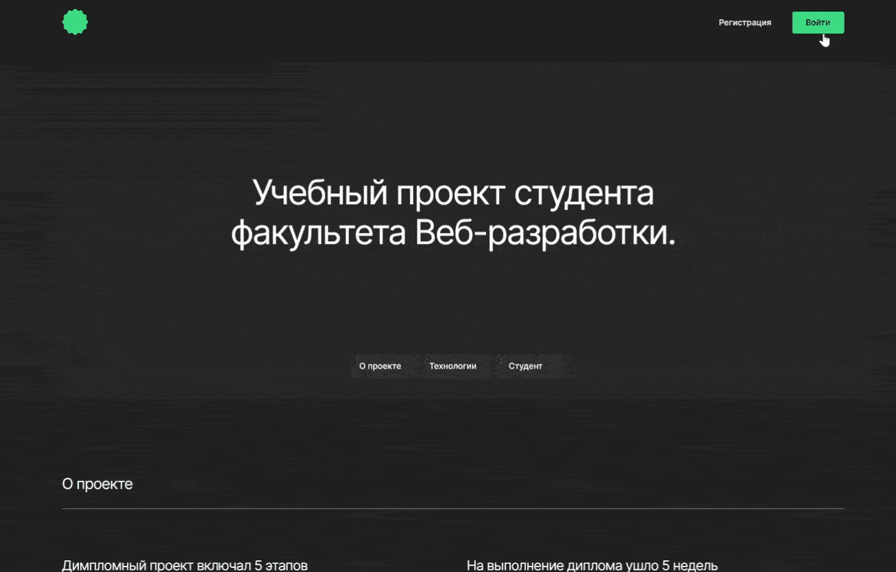

# Movie Explorer


## Описание
SPA приложение в котором можно найти фильмы по запросу и сохранить в личном кабинете.</br>

Адрес: https://movie-explorer.nomoredomains.icu </br>
Ссылка на макет: https://www.figma.com/file/7jQirDuKKvdokilmqY6mOl/Diploma?node-id=891%3A3857

## Задача
* Сделать адаптивную верстку
* Настроить и защитить роуты
* Получить данные по API, обработать и отрендерить
* Валидировать формы

## Логика
* При авторизации уходят GET запросы за данными сохраненных фильмов и информации о пользователе.
* Клик по кнопке Найти отправляет GET запрос за данными на сервер. Данные записываются в LS — далее поиск фильмов происходит в LS.
* На роуте /movies, клик на иконке сердца добавляет фильм на страницу Сохраненные фильмы — по клику на иконку уходит POST запрос, данные сохраняются на сервере.
* На роуте /saved-movies, клик по крестику удаляет фильм из сохраненных.
* Реализован фильтр по короткометражным фильмам длительностью до 40 минут.
* На роуте /movies в зависимости от разрешения экрана рендерится разное количество карточек. На мобильном 5 карточек, а планшете и десктопе 7. Если в результатах поиска карточек больше, то появляется кнопка Еще. При каждом клике на нее рендерятся следующие 7 карточек. Если рендерить больше нечего, то кнопка исчезает.
* Добавлен и настроен прелоудер.
* Можно редактировать профиль пользователя — обновленные данные сохраняются на сервере.
* При логауте  очищается LS и удаляются все стейты.

## Стек
* React
* JavaScript
* HTML5
* CSS
* BEM
* WebPack
* API

## Установка
Для запуска на локальной машине необходимо:</br>
1. Установить npm зависимости:</br>
```sh
npm install
```
2. Запустить в режиме разработки:</br>
```sh
npm run start
```
Если все прошло успешно, проект будет запущен на `http://localhost:3000`

## Превью
